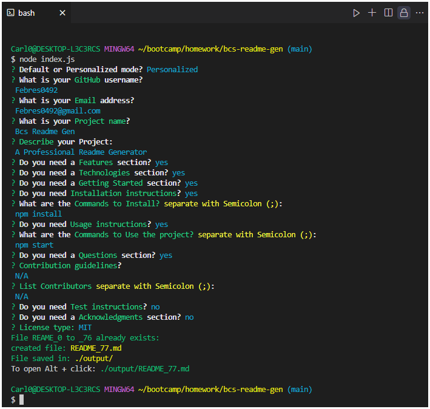

# Bcs Readme Gen 

 
            
## Description
            
A Professional Readme Generator 
            
Application is live at: https://example.com 


## Table of Content 
- [Features](#features)
- [Technologies](#technologies)
- [Getting Started](#getting-started)
- [Installation](#installation)
- [Usage](#usage)
- [Author](#author)
- [Contribution](#contribution)
- [Contribution Guidelines](#contribution-guidelines)
- [Questions](#questions)
- [License](#license)


## Features 

- **Features 1:** Lorem sed voluptua voluptua sit diam lorem,. 
- **Features 2:** Lorem sed voluptua voluptua sit diam lorem,. 
- **Features 3:** Lorem sed voluptua voluptua sit diam lorem,


## Technologies 
Technologies used: 
- **Node Js** 


## Getting Started 
This section will guide you through setting up the project locally. By the end of this guide, you will have a working version of Bcs Readme Gen running on your machine.


### Prerequisites
Before you begin, ensure you have the following installed:
            
- [Node.js](https://nodejs.org/) (v14.0 or later)
            
- [Git](https://git-scm.com/)
            
- A text editor like [VSCode](https://code.visualstudio.com/)
        


## Installation 
Follow these steps to get your development environment set up: 
```bash 
cd bcs-readme-gen
npm install 
``` 


## Usage 
Follow these steps to get your development environment set up: 
```bash 
npm start 
``` 


## Author 
Carlos Febres


## Contribution Guidelines 
Contributions are welcome


## Questions 
For questions please get in contant.  
Github Profile: https://github.com/Febres0492  
Email: Febres0492@gmail.com


## License  
[](https://opensource.org/licenses/MIT)
    
This project is licensed under the MIT License - see the [LICENSE](https://opensource.org/licenses/MIT) for details.
    


